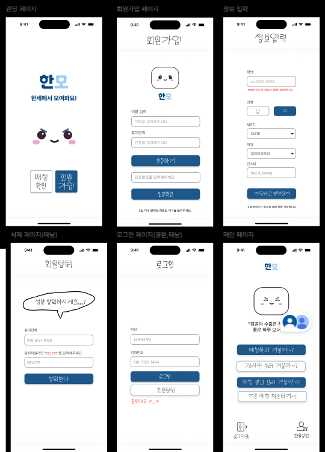

# Hanmo 한세 과팅/친구 사귀기 어플
---

## 👉 프로젝트 개요
* ## 프로젝트 선택배경   
> : 학기 초 활발하게 이루어지는 과팅이 시간이 지나면서 관심이 줄어들면서,  
**학생간의 교류가 적어지게 되는 문제점**을 해결하기 위함.   
또한, **축제기간 동안 함께 즐길 수 있는 친구**를 만들어 축제 활성화를 도움   
* ## 프로젝트 목표   
> : 1:1 동성 간 매칭, 2:2 이성 간 매칭을 통해   
교내에서 **새로운 친구를 사귈 수 있도록 돕는 서비스**를  
구현하여 **교내 학생들간의 교류를 활발**하기 위함   

---

## Server 구조

 > CI/CD  
> 1. Git Push를 하고 master브랜치(배포용 브랜치)에 올리면, Jenkins서버로 바로 Hook을 날립니다.
> 2. Jenkins에서 Test를 진행 한 후에 Docker 이미지로 제작을 합니다.
> 3. SpringBoot서버로 바로 컨테이너를 올려 배포를 시작합니다.

## ☑️ figma
주소 : https://www.figma.com/design/coLvBC7Iqj5uJgUjZAOUcY/%ED%95%9C%EB%AA%A8?node-id=0-1&p=f&t=Ox84JZX2RK7CG0pA-0

## ☑️ 프론트엔드 배포 주소
주소 : https://hanmo-front.vercel.app/landing

## ☑️ Swagger
주소 : https://hanmo.store/api/swagger-ui/index.html#/

## ☑️ 기능명세서
주소 : https://docs.google.com/spreadsheets/d/1JE8XKR276VxA5LdkBcax9DjOBxP-GwB1Ri0WR1a8sHE/edit?gid=0#gid=0

## ☑️ WBS
주소 : https://docs.google.com/spreadsheets/d/1MJ3ztSCG_p-YSx11Sm2T_OwdkF1ltrcpEdc58xBeTxA/edit?gid=0#gid=0

## ☑️ BE 오픈소스 고지서

| 라이브러리 | 버전 | 사용 목적 | 라이선스 | 확인 링크 |
|------------|------|-----------|-----------|------------|
| Spring Boot Starter Web | 3.4.3 | REST API 개발 | Apache 2.0 | [LICENSE](https://github.com/spring-projects/spring-boot/blob/main/LICENSE.txt) |
| Spring Boot Starter Security | 3.4.3 | 인증/인가 처리 | Apache 2.0 | [LICENSE](https://github.com/spring-projects/spring-boot/blob/main/LICENSE.txt) |
| Spring Boot Starter Data JPA | 3.4.3 | ORM 및 DB 연동 | Apache 2.0 | [LICENSE](https://github.com/spring-projects/spring-boot/blob/main/LICENSE.txt) |
| Spring Boot Starter Validation | 3.4.3 | 유효성 검사 | Apache 2.0 | [LICENSE](https://github.com/spring-projects/spring-boot/blob/main/LICENSE.txt) |
| Spring Boot Starter Data Redis | 3.4.3 | Redis 연동 | Apache 2.0 | [LICENSE](https://github.com/spring-projects/spring-boot/blob/main/LICENSE.txt) |
| Lettuce Core (Redis Client) | 자동 포함 | Redis 클라이언트 | Apache 2.0 | [LICENSE](https://github.com/lettuce-io/lettuce-core/blob/main/LICENSE) |
| MySQL Connector/J | 8.0.33 | MySQL DB 연동 | GPL v2 with FOSS Exception | [LICENSE](https://github.com/mysql/mysql-connector-j/blob/release/8.0/LICENSE) |
| Lombok | 1.18.30 | 코드 간결화 | MIT | [LICENSE](https://github.com/projectlombok/lombok/blob/master/LICENSE) |
| Springdoc OpenAPI UI | 2.7.0 | Swagger API 문서 자동화 | Apache 2.0 | [LICENSE](https://github.com/springdoc/springdoc-openapi/blob/master/LICENSE) |
| QueryDSL JPA | 5.0.0 | 동적 쿼리 작성 | Apache 2.0 | [LICENSE](https://github.com/querydsl/querydsl/blob/master/LICENSE.txt) |
| Nurigo SDK | 4.3.0 | SMS 문자 전송 | Apache 2.0 | [LICENSE](https://github.com/nurigo/javaSDK/blob/master/LICENSE) |
| Jasypt Spring Boot Starter | 3.0.4 | 민감 정보 암호화 | Apache 2.0 | [LICENSE](https://github.com/ulisesbocchio/jasypt-spring-boot/blob/main/LICENSE) |
| Mockito (inline, junit) | 4.8.1 | 단위 테스트 | MIT | [LICENSE](https://github.com/mockito/mockito/blob/main/LICENSE) |

---
## 💁 조원
* Frontend: 유상진, 이경환
* Backend: 김예람, 김태남, 박다혜, 박지훈
---

## ✅ 개발 단계 ✅

### 🟢 1차 개발 (완료)
- 회원가입 & SMS 인증
- 로그인 (tempToken 헤더 인증)
- 예외 처리 & 유효성 검사
- 1:1·2:2 랜덤 매칭
- 개발자에게 한마디등의 게시판
- Docker Compose 기반 인프라 구축

### 🔵 2차 개발 (진행 중)
- 성별·MBTI·나이 등 **선호 조건 매칭**
- WebSocket/Redis Pub‑Sub 기반 **실시간 채팅** 
- 관리자 페이지 (신고·삭제 관리)
- 각 번개모임 게시판, (커피 지금 이공관에서 마실 사람~ 게시물 등의 페이지)
- React 프론트와 CORS·쿠키 연동 최적화

💡 **추가 아이디어**: 맛집 지도 · 대화 가이드

---

## 프로젝트 주요 관심사

### 공통 사항
- 지속적인 성능 개선
- 나쁜 코드 제거를 위한 리팩토링

### 코드 컨벤션
- Google Java Style Guide 준수
- IntelliJ STS CheckStyle 플러그인 적용
- 가이드 링크: https://google.github.io/styleguide/javaguide.html

### 성능 최적화
- Redis 등 캐싱 서버 적극 활용으로 서버 부하 감소
- N+1 쿼리 지양, DB 통신 최소화
- 적절한 인덱스 & 쿼리 튜닝
- 외부 API 호출은 비동기 처리

---

## 기술 스택
### Frontend
* 라이브러리: REACT 
* 프레임워크: NEXT.JS 
* 언어: TypeScript 
* 스타일링: Styled-components (CSS-in-JS 방식) 
* 상태 관리: Recoil 
* API 통신: Axios
### Backend

- **프레임워크**: Spring Boot
- **언어**: Java 21
- **데이터베이스**: MySQL, Redis (NoSQL)
- **메시지 큐**: Kafka (여유 시 도입)
- **Infra & CI/CD**: Docker, Jenkins, AWS RDS, S3

# 주요 흐름

1. **첫 화면**
    - "한모 : 한세에서 모여봐요!"라는 메시지와 한모 캐릭터
    - 매칭 확인 / 회원가입 이동 가능
    - **다음** 버튼을 클릭하면 다음 단계로 이동

2. **전화번호 인증 (본인 인증)**
    - 전화번호를 입력받고, sms 본인 인증을 통해 **일련번호** 발급
    - **본인 인증**을 완료한 후 다음 단계로 이동

3. **정보 입력 (MBTI, 성별, 학과, 나이, 인스타그램 ID)**
    - 사용자가 MBTI 유형, 성별, 학과, 나이, 인스타그램 ID 등을 입력
    - **다음** 버튼을 클릭하여 랜덤 별명 생성 페이지로 이동
      
4. **학부와 별명 (랜덤 별명) 생성**
    - 세 번째 페이지에서 입력한 학과를 바탕으로 별명(예: "컴퓨터공학과” + “수줍은” + “하마") 생성
    - 별명은 최대 한 번 다시 생성 가능

5. **메인 페이지 ⇒ 매칭하기 or 게시판 가기**

6. **매칭하기**
    - 사용자가 **매칭 시작** 버튼 클릭
    - 매칭 그룹이 생성되며, 1/4로 유저가 한 명씩 매칭 그룹에 배정
    - 같은학과 or 다른학과 포함 고를 수 있으면 좋을듯?
    - 1:1은 동성끼리 (학과 구분 X), 2:2는 이성끼리 (동성은 같은 학과 O)
    - 남자 2명, 여자 2명씩 차면 새로운 그룹 생성
    - **매칭 완료된 유저**는 `매칭유저` 테이블에 저장되고, `status` 값은 "매칭 완료"로 변경

7. **매칭 완료**
    - 매칭 완료된 4명의 **닉네임과 인스타그램 ID**를 사용자에게 보여줌
    - 메시지: "매칭 완료되었습니다. 상단에 기재된 사람은 30분 내로 인스타 DM방을 만들어주세요."

8. **게시판**
    - 개발자에게 한 마디, 과팅 리뷰 등 자유롭게 작성
    - **페이지네이션 또는 무한 스크롤**로 구현 예정
    - 글자 제한(말풍선 크기 조정)

## 초기 ERD 설계 이미지

## Figma 이미지

